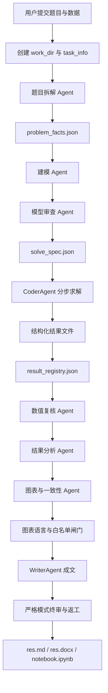
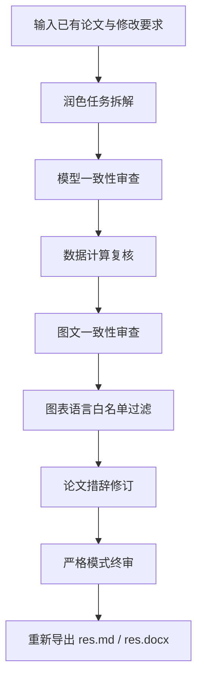

# MCMer 技术架构与 Agent 工作流：面向数学建模论文生成的多智能体系统

>原谅我使用了这么一个很竞赛意味的标题。首先感谢MIMO以及雷总的大力援助，几段时间高强度使用MIMO的API才使得此项目具有一个相对完善的雏形。以及感谢copilot老师和codex老师对本项目落地的大力援助（）

MCMer 是一个面向数学建模场景的全栈多 Agent 系统。它的目标不是简单地把大模型包装成“论文生成器”，而是把竞赛建模中的题目理解、假设提取、模型设计、代码求解、数值复核、图表生成、论文写作和历史项目管理拆成一条可追踪、可复核、可保存的工程链路。

从用户视角看，MCMer 提供两个主要入口：

- **写作任务**：从原题、附件数据和用户要求出发，自动完成题目拆解、建模、求解、复核、图表和论文生成。
- **论文润色任务**：对已有论文做一致性审查、数据复核、图文核对和竞赛风格修订。

从工程视角看，它是一套由 FastAPI、Vue、WebSocket、LiteLLM、Jupyter Kernel、本地文件工作区和多阶段 Agent 编排组成的系统。每个任务都会拥有独立工作目录，所有中间产物和最终产物都会沉淀到本地 `work_dir/<task_id>/`，便于复盘、下载和继续修订。

---

## 一、系统整体架构

MCMer 的工程结构可以概括为三层：

```text
MCMer/
├── backend/              # FastAPI 后端、Agent 编排、代码解释器、任务管理
├── frontend/             # Vue 3 前端、任务提交、进度展示、历史项目回看
├── docs/                 # 项目文档与截图
├── work_dir/             # 所有任务的本地工作目录和产物
├── docker-compose.yml    # Redis、后端、前端组合启动
└── README.md
```

后端是整个系统的核心。它负责：

1. 接收题目、附件、论文和工作流模式。
2. 为每个任务创建独立 `work_dir`。
3. 通过 WebSocket 持续向前端推送阶段进度。
4. 调用不同 Agent 完成题目拆解、建模、求解、复核、写作和审查。
5. 管理本地代码执行环境。
6. 生成 `res.md`、`res.docx`、`res.json`、`notebook.ipynb` 等最终产物。

前端则负责把这个复杂过程折叠成可操作的产品体验：上传文件、选择模型、选择工作流模式、实时查看 Agent 输出、打开历史项目、下载 DOCX 或 Notebook。

---

## 二、为什么需要多 Agent，而不是一个大 Prompt

数学建模论文生成有一个很容易被低估的问题：它不是单一文本生成任务。

一篇可交付的建模论文至少包含这些不同性质的工作：

- 理解题目条件和不可修改的已知事实。
- 设计变量、参数、假设和目标函数。
- 读取数据并运行计算。
- 判断数值是否可验证。
- 生成图表并保证图文一致。
- 把已验证结果写入论文。
- 对不可靠结果降级说明。
- 导出成 Markdown、DOCX 和 Notebook。

如果让一个 Agent 在一次上下文中完成全部工作，它很容易出现几个典型问题：

- 把未计算的值写成确定结论。
- 代码失败后用自然语言“补”结果。
- 图表和正文使用了不同的数据口径。
- 中英文图表注释混用。
- 临时探索图被误放进最终论文。
- 任务中断后无法复盘到底完成了什么。

MCMer 的设计思路是：**把大模型变成流程中的参与者，而不是让它独自承担全部责任**。每个 Agent 只负责一段明确工作，并通过结构化文件把结果交给下一阶段。

---

## 三、任务工作区：所有产物必须落盘

每个任务都会在 `work_dir/<task_id>/` 下创建独立工作区。典型目录如下：

```text
work_dir/<task_id>/
├── data/                         # 用户上传的数据和解析后的源数据
├── inputs/                       # 原题、论文等输入文件
├── output/                       # 可进入论文的最终图表或结果文件
├── figures/                      # 可进入论文的图表
├── debug_artifacts/              # 调试图、探索图、诊断图
├── problem_facts.json            # 题面事实和不可修改条件
├── solve_spec.json               # 求解规格和子问题拆分
├── result_registry.json          # 可验证结果注册表
├── verify_plan.json              # 数值复核计划
├── res.md                        # 最终 Markdown 论文
├── res.docx                      # 最终 Word 文档
├── res.json                      # 全流程结构化记录
├── notebook.ipynb                # 代码执行 Notebook
└── task_info.json                # 任务元信息
```

这个设计非常重要。MCMer 不把 Agent 输出只留在聊天记录里，而是要求关键结果落盘。这样做有几个好处：

- 历史任务可以被重新打开。
- 前端下载不会依赖内存态内容。
- Docker 容器重启后产物仍然保留在宿主机。
- 后续 Agent 可以读取前一阶段的结构化结果。
- 出错时可以定位到底是求解失败、复核失败、写作误用，还是导出失败。

Docker Compose 模式下，项目根目录的 `work_dir` 会挂载到容器内 `/app/work_dir`。因此后端在容器里生成的文件也会同步出现在本地项目目录中。

---

## 四、核心写作工作流

写作任务的主流程由 `backend/app/core/workflow.py` 编排。可以简化成下面这张图：



### 1. 题目拆解

题目拆解阶段的目标是把用户输入变成后续可执行的结构化上下文，包括：

- 问题背景。
- 子问题列表。
- 已知条件。
- 不可修改的题面常量。
- 给定公式。
- 数据文件来源。
- 需要复核的关键点。

拆解结果会进一步整理为 `problem_facts.json`。这是后续防止 Agent 修改题面事实的重要依据。

### 2. 建模与模型审查

建模阶段负责提出变量、符号、假设、目标函数、约束和算法路线。模型审查阶段负责检查：

- 公式口径是否自洽。
- 单位是否一致。
- 目标函数是否有题面依据。
- 关键假设是否被写成了事实。
- 是否存在明显无法求解或证据不足的地方。

这一步的意义在于提前把“模型想法”和“可计算路径”分开。一个漂亮的建模描述如果没有可执行的数据路径，不能直接进入求解。

### 3. 求解规格 `solve_spec.json`

系统会把题目拆解、建模和审查结果压缩为 `solve_spec.json`。它决定 CoderAgent 后续怎么运行：

- 是否拆分多个子问题。
- 每个子问题需要哪些输入。
- 每个子问题期望输出哪些结果。
- 哪些结果必须写入结构化 JSON。
- 哪些内容只能作为探索性结论。

在 `standard` 和 `strict` 模式下，如果 `solve_spec` 中有多个子问题，系统会倾向于分步执行，并在每个子问题完成后立刻落盘结果。

### 4. CoderAgent 求解

CoderAgent 是系统中最工程化的 Agent。它不仅写代码，还必须遵守一组执行契约：

- 只能使用当前环境已安装的库。
- 必须生成结构化结果文件。
- 关键数值必须写入 `key_results`。
- 图表必须写入 `generated_files`。
- 不可靠、失败或被阻断的结果必须写入 `warnings`。
- 临时图、调试图和探索图必须进入 `debug_artifacts/`，不能进入最终论文。

结构化结果文件至少包含：

```json
{
  "section": "算法与编程求解",
  "summary": "...",
  "key_results": [],
  "generated_files": [],
  "warnings": []
}
```

这使得后续复核和写作可以读取机器可解析结果，而不是从自然语言总结里猜测哪些值可信。

### 5. 结果注册表 `result_registry.json`

所有结构化结果会被汇总为 `result_registry.json`。这是论文写作阶段最重要的数据来源。

它会区分：

- `verified_results`：已经通过基本证据链和复核要求，可以写入论文的结果。
- `blocked_results`：执行失败、证据不足、单位冲突或公式口径错误的结果。
- `summary`：记录 verified/blocked 数量和覆盖率。

WriterAgent 在写论文时被要求：**具体数值只能来自 `verified_results`**。如果某项结果被阻断，就必须降级说明，而不能写成确定结论。

---

## 五、工作流模式：fast、standard、strict

MCMer 支持三种工作流模式。它们不是“论文长短”的简单区别，而是对预算、复核强度和返工策略的不同配置。

### fast

`fast` 适合快速得到可用草稿。它会减少独立审查和返工次数，优先生成建模框架、核心流程和必要结果。

适用场景：

- 快速理解题目。
- 生成初版建模思路。
- 时间优先于严谨复核。

### standard

`standard` 是默认模式。它会在速度和可靠性之间折中：

- 正常执行题目拆解、建模、审查、求解、复核、分析和写作。
- 多子问题会拆开求解。
- 每个子问题有独立预算。
- 结果会进入 `result_registry.json`。

### strict

`strict` 更强调可验证性，而不是生成更长文本。它会加强：

- 数值复核。
- 单位一致性。
- 公式来源。
- 图表语言和图文一致性。
- 最终审查与返工。

严格模式下，如果某些结果无法验证，系统会宁可保留阻断说明，也不会把不可靠结果写成定论。

---

## 六、图表语言闸门：从 Prompt 约束升级到产物白名单

在数学建模论文中，图表往往是最容易“悄悄出错”的部分。尤其在中英文混合场景下，可能出现：

- 中文论文中插入英文坐标轴图片。
- 英文论文中插入中文图例，导致字体方框。
- 求解阶段的调试图被 Writer 当成正式图。
- 图片路径存在，但图内文字语言不符合论文语言。

早期仅靠 Prompt 约束，例如“请按照文章语言生成图表”，并不足够稳定。因为模型可能在某次求解中忘记翻译轴标签，或者在写作阶段引用了旧图片。

因此现在的设计升级为三层约束。

### 1. 图表语言策略

系统会根据题目和论文内容自动判断文档语言：

- 英文任务：所有可见图中文字必须是英文。
- 中文任务：标题、坐标轴、图例、注释、色条、分类刻度必须是简体中文。

对于 NIPT 等医学建模任务，还加入了常见术语翻译规则，例如：

| 英文标签 | 中文标签 |
|:---|:---|
| Gestational Week | 孕周 |
| Maternal BMI | 孕妇BMI |
| Y Chromosome Concentration | Y染色体浓度 |
| Recommended Gestational Week | 推荐检测孕周 |
| Cluster | 聚类簇 |
| Sample Count | 样本数 |
| Threshold | 阈值 |
| Distribution | 分布 |
| Normal / Overweight / Obese | 正常 / 超重 / 肥胖 |

### 2. 严格图表产物契约

现在最终图表不能只登记成一个路径字符串。它必须在 `generated_files` 中写成对象，并带上语言审查元数据：

```json
{
  "path": "output/figure.png",
  "kind": "figure",
  "paper_ready": true,
  "visible_text_language": "Simplified Chinese",
  "chart_language_verified": true,
  "visible_text_audit": [
    "title",
    "axis labels",
    "legend",
    "annotations",
    "colorbar",
    "tick labels"
  ]
}
```

如果图片只是：

```json
"output/figure.png"
```

那么它默认不能进入论文。系统会认为它没有通过语言审查。

### 3. 写作白名单和终稿出口拦截

写作阶段不再接收全部 `created_images`，而是只接收 `paper_ready_images`。这个列表由后端根据结构化结果文件自动过滤：

- 图片路径必须存在。
- 图片必须位于 `output/`、`figures/` 或 `final_results/`。
- `visible_text_language` 必须匹配文章语言。
- `chart_language_verified` 或 `paper_ready` 必须为真。
- 明确失败的图片不能进入白名单。

更进一步，即使 WriterAgent 在正文中写出了某个旧图片路径，最终保存 `res.md` 和 `res.docx` 前，后端还会再次执行白名单检查。不在白名单里的图片引用会被移除。

这套机制的原则是：**宁可少放一张图，也不让语言错误或来源不明的图进入最终论文**。

---

## 七、调试图和最终图的隔离

代码求解阶段经常会产生探索性图表，例如：

- 变量分布快速检查图。
- 散点矩阵。
- 中间拟合诊断图。
- 调试用可视化。

这些图对开发和排错有用，但不一定适合进入论文。因此 MCMer 将图片分成两类：

- `output/`、`figures/`、`final_results/`：可进入论文的最终图。
- `debug_artifacts/`：调试图、探索图、诊断图。

后端会把没有被结构化结果登记的 `output/` 图片转移到 `debug_artifacts/`，避免 WriterAgent 误用。代码解释器列举图片时，也会忽略 `debug_artifacts/`、`inputs/`、`data/` 和 `source_bundle/` 等目录。

---

## 八、论文润色工作流

润色任务不是简单改写文字，而是对已有论文做一次“再审查”。

它的流程大致如下：



润色阶段同样使用图表语言契约。如果重新绘制替代图，也必须登记语言审查元数据；否则不会进入最终论文。

---

## 九、本地代码执行：Jupyter Kernel 与 Notebook 留痕

MCMer 的本地代码执行器基于 Jupyter Kernel。任务开始后，后端会在对应 `work_dir` 中启动执行环境，并把工作目录切换到该任务目录。

这样 CoderAgent 写出的代码天然以任务目录为根：

```python
import pandas as pd

df = pd.read_excel("data/附件.xlsx")
df.to_csv("output/cleaned.csv", index=False)
```

执行完成后，系统会保存 `notebook.ipynb`，用于复盘：

- 哪些代码被执行过。
- 哪些图片和 CSV 被生成。
- 哪一步失败。
- 哪些中间结果可以复用。

这比只保存最终论文更适合工程调试，也更符合数学建模“可复现”的要求。

---

## 十、Docker 开发模式与工作目录挂载

项目支持 Docker Compose 启动 Redis、后端和前端。当前设计中，后端开发体验做了热重载优化：

- `./backend` 挂载到容器 `/app`。
- `./work_dir` 挂载到容器 `/app/work_dir`。
- 后端通过 `uvicorn --reload` 启动。
- 修改 `.py` 文件后容器自动重载。

因此，日常修改后端业务代码不需要每次重新构建镜像。只有在这些场景下才需要重新构建：

- 修改 `backend/Dockerfile`。
- 修改 `backend/pyproject.toml`。
- 新增系统依赖。
- 新增 Python 依赖并需要安装进镜像。

如果宿主机项目父目录被重命名，Docker 的 bind mount 可能仍指向旧路径。这时需要重新执行：

```powershell
docker compose down
docker compose up -d --build
```

这样 Compose 会重新绑定当前路径下的 `work_dir`。

---

## 十一、前端交互设计

前端主要由 Vue 3 组成，核心职责包括：

- 新建写作任务。
- 新建润色任务。
- 上传原题、论文和数据文件。
- 选择 `fast`、`standard`、`strict` 工作流。
- 展示 WebSocket 实时进度。
- 展示历史项目。
- 打开已生成论文。
- 下载 DOCX 和 Notebook。

历史项目不是从数据库中“猜”出来的，而是扫描 `work_dir` 下的任务目录和 `task_info.json`。这意味着只要本地工作目录还在，历史项目就可以重新进入。

---

## 十二、Agent 设计细节

MCMer 中的 Agent 不是平级聊天机器人，而是被工作流约束的角色。

### Agent 基类

基础 Agent 负责：

- 保存聊天历史。
- 管理最大轮次。
- 调用 LLM。
- 追加系统提示和用户提示。
- 输出自然语言结果。

### CoderAgent

CoderAgent 负责工程化求解。它是约束最多的 Agent：

- 有工具调用预算。
- 有执行时间预算。
- 有结构化结果契约。
- 有重复代码执行检测。
- 有被阻断后的保底结果写入机制。
- 有已有文件 salvage 能力。

当 CoderAgent 接近工具调用上限时，系统会切换到“最小数值交付模式”：优先写出已经算出的关键数值表、参数表、源数据路径和失败原因，而不是继续探索模型。

### WriterAgent

WriterAgent 负责把各阶段结果组织成论文。但它不应该自由发挥具体数值。它被要求：

- 具体数值必须来自 `result_registry.json`。
- blocked 结果必须降级说明。
- 参考文献必须来自 scholar 工具或用户材料。
- 图片只能来自后端传入的 `paper_ready_images`。

这种设计避免了 WriterAgent 把模型想象、代码中间输出和未验证结果混在一起。

---

## 十三、最终导出链路

最终输出由 `_finalize_outputs` 完成：

1. 保存 Notebook。
2. 规范化 Markdown 数学公式。
3. 规范化图片路径。
4. 执行图片白名单检查。
5. 保存 `res.md`。
6. 保存 `res.json`。
7. 转换 `res.docx`。

DOCX 转换优先使用 Pandoc。如果不可用，则使用 `python-docx` 兜底。无论哪种方式，最终目标都是让本地图片真正嵌入 Word 文件，而不是只留下占位路径。

---

## 十四、设计取舍

MCMer 的设计明显偏向“可追踪”和“可复核”，而不是追求一次生成的表面流畅。它做了几项有意的取舍：

### 1. 结果必须落盘

这会让流程更复杂，但换来任务可恢复、可调试、可下载。

### 2. 数值必须经过注册表

这减少了 WriterAgent 的自由度，但能显著降低编造结果的风险。

### 3. 错误图表宁可不放

图表白名单可能导致某些任务最终少图，但这比中英文错标、方框字体或调试图进入论文更可控。

### 4. strict 模式不追求长文

严格模式强调证据链，而不是篇幅。它会压缩套话，把空间留给公式、表格、误差说明和阻断说明。

---

## 十五、后续可以继续强化的方向

当前架构已经具备比较完整的多 Agent 论文生成链路，但仍有一些值得继续推进的方向：

1. **图表 OCR 审查**
   现在图表语言闸门主要依赖结构化元数据。未来可以加入 OCR 或视觉模型，对 PNG 中的真实文字做二次验证。

2. **更细的结果血缘追踪**
   `result_registry.json` 可以进一步记录每个结果对应的代码单元、输入文件哈希和生成时间。

3. **审查报告可视化**
   前端可以把 verified、blocked、warnings 做成独立面板，让用户更容易理解论文可靠性。

4. **任务级缓存**
   对已完成的数据清洗、模型拟合和图表生成做缓存，减少返工时重复计算。

5. **更强的文档渲染验证**
   DOCX 生成后可以自动渲染为图片或 PDF，检查图片缺失、公式错位和表格溢出。

---

## 结语

MCMer 的核心思路可以概括为一句话：**用 Agent 完成创造性工作，用工程约束守住可验证边界**。

大模型擅长理解题目、组织思路和生成代码，但数学建模论文需要的不只是“看起来合理”。它还需要结果能追溯、代码能复盘、图片能验证、失败能说明、最终文件能落到本地。

因此，MCMer 把多 Agent 工作流、结构化结果注册、本地工作目录、Notebook 留痕、图表语言闸门和 DOCX 导出串成一条完整链路。它不是把论文生成当成一次聊天，而是把它当成一个可以持续迭代、可以审查、可以回看的工程流程。
